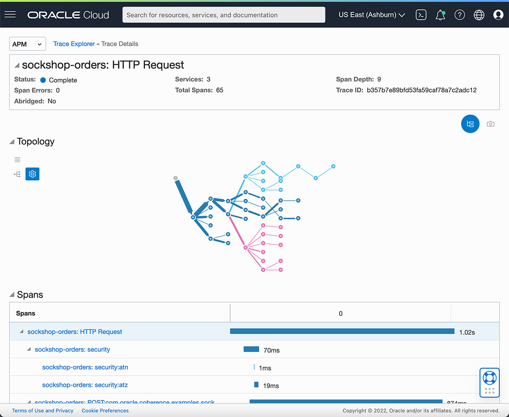

# Oracle Cloud Infrastructure (OCI)

In this guide we illustrate the integration of Coherence Helidon Sock Shop with
Oracle Cloud Infrastructure (OCI) Application Performance Monitoring (APM) as another option to process
distributed traces.

To set up Sock Shop with APM, please follow the guide [Complete Application Deployment](complete-application-deployment.md)
but please ignore the section about _Jaeger_.

## OCI APM Documentation

You can find the official OCI APM Documentation at:

- https://docs.oracle.com/en-us/iaas/application-performance-monitoring/index.html

## Setup OCI APM

In order to set up APM we will start from scratch. The only requirement is that you have a valid account for OCI. Here are
the basic steps to set up APM:

1. Login to OCI.
2. Under `Observability and Management`, select `Application Performance Administration`.
3. Click on `Create APM Domain`.
4. Enter a name `Coherence Spring Sock Shop`.
5. Please do NOT check the checkbox `Create as Always Free Domain`. The Helidon implementation of Sock Shop produces
   a substantial amount of tracing data easily surpassing the permitted amount of the free tier.
6. Click on the link `Coherence Spring Sock Shop` to enter the `Domain Details` screen.

On the `Domain Details` screen, we are interested in 2 values:

- Data Upload Endpoint
- Private Data Key

There is also a public Data Key, but it cannot be used for `apm-java-agent-helidon`. Under the covers the Data Upload Endpoint
and the Private Data Key will be used to form the _APM Collector URL_. For detailed information on the _APM Collector URL Format_
see [the reference guide](https://docs.oracle.com/en-us/iaas/application-performance-monitoring/doc/configure-open-source-tracing-systems.html#APMGN-GUID-B5EDE254-C854-436D-B844-B986A4E077AA).

## Configure the Helidon Sock Shop for APM

We need to enable tracing for OCI APM for each microservice by:

- Adding the `apm-java-agent-helidon` dependency
- Updating `microprofile-config.properties`

The `apm-java-agent-helidon` dependency is not part of Maven Central. As such we need to first add another
repository to the `pom.xml` of each Maven module:

```xml
<repository>
    <id>oci</id>
    <name>OCI Object Store</name>
    <url>https://objectstorage.us-ashburn-1.oraclecloud.com/n/idhph4hmky92/b/prod-agent-binaries/o</url>
</repository>
```

Next, comment out the `helidon-tracing-jaeger` Maven dependency:

```xml
<dependency>
    <groupId>io.helidon.tracing</groupId>
    <artifactId>helidon-tracing-jaeger</artifactId>
</dependency>
```

Then update the `pom.xml` for each microservice and add the following dependencies:

```xml
<dependency>
    <groupId>com.oracle.apm.agent.java</groupId>
    <artifactId>apm-java-agent-tracer</artifactId>
    <version>[1.0.1389,)</version>
</dependency>
<dependency>
    <groupId>com.oracle.apm.agent.java</groupId>
    <artifactId>apm-java-agent-helidon</artifactId>
    <version>[1.0.1389,)</version>
</dependency>
```

Next, we will update the `microprofile-config.properties` for each microservice and add the `tracing` information:

```properties
tracing.name="Helidon Sock Shop APM Tracer"
tracing.service=sockshop-users
tracing.data-upload-endpoint=https://[redacted].apm-agt.us-ashburn-1.oci.oraclecloud.com
tracing.private-data-key=[your private key]
tracing.collect-metrics=true
tracing.collect-resources=true
tracing.tags.tag1="Hello Helidon!"
```

Here we will also set the `data-upload-endpoint` for APM that we obtained in the previous section.
Please make sure that the property `tracing.service` is different for each Sock Shop microservice.

For a detailed overview of available properties, please see the chapter 
[Use APM Tracer in Helidon](https://docs.oracle.com/en-us/iaas/application-performance-monitoring/doc/use-apm-tracer-helidon.html)
in the Oracle Cloud Infrastructure documentation.

Rebuild Sock Ship using:

```bash
mvn package -Pcontainer -DskipTests
```

This will update your local Docker registry with the new images. See the [development guide](./development.md) for details.

**Important:** You may have to update the `/k8s/coherence/*/app.yaml` files and add

```yaml
spec:
  imagePullPolicy: Never
```

Redeploy the Sock Shop services to your Kubernetes cluster:

```bash
kubectl delete -k k8s/coherence --namespace sockshop
kubectl apply -k k8s/coherence --namespace sockshop
```

**TIP:** If you need to redeploy individual services, use:

```bash
kubectl delete -f k8s/coherence/orders/app.yaml --namespace sockshop
kubectl apply -f k8s/coherence/orders/app.yaml --namespace sockshop
```

Now order some socks and head over to the APM dashboard afterwards at:

- https://cloud.oracle.com/apm/apm-traces

There, select your `Compartment` and your `APM Domain` and then click on the run button, and you should see the traces
that were emitted from the Sock Shop application.


